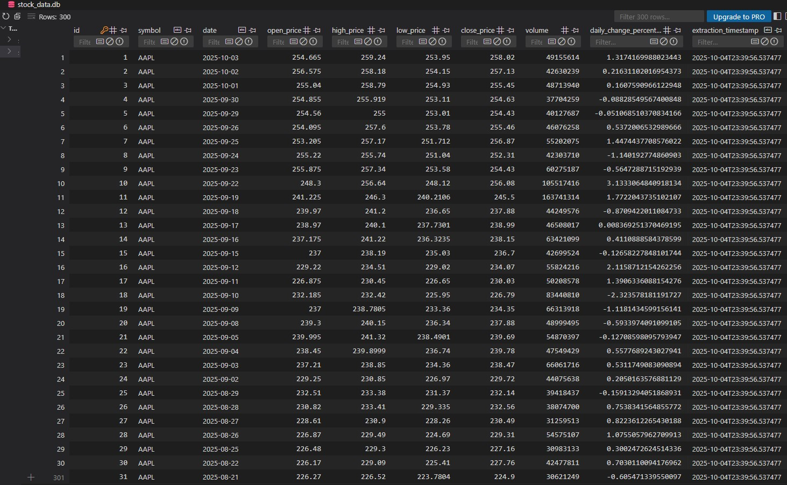

# 📈 Stock ETL Project

An ETL pipeline in Python that fetches, processes, and loads daily stock data for **AAPL**, **GOOG**, and **MSFT** using the [Alpha Vantage API](https://www.alphavantage.co/).  
Built as part of the **Batch 9 Data Engineering Intern Project Assignment**.

---

## 🚀 Features

- ✅ Extracts daily stock data using Alpha Vantage’s `TIME_SERIES_DAILY` endpoint
- ✅ Saves raw JSON files locally in a data lake folder (`raw_data/`)
- ✅ Transforms data using pandas and calculates **daily change percentage**
- ✅ Loads cleaned data into a SQLite database (`stock_data.db`)
- ✅ Ensures **no duplicate records** per stock and date
- ✅ Optional: Pydantic data validation + daily scheduling with `schedule`

---

## 🛠️ Tech Stack

- Python 3.11+
- [requests](https://pypi.org/project/requests/)
- [pandas](https://pandas.pydata.org/)
- [Pydantic](https://docs.pydantic.dev/) (optional)
- [schedule](https://schedule.readthedocs.io/en/stable/) (optional)
- SQLite (via built-in `sqlite3`)

---

## 📁 Project Structure

stock_etl_project/
│
├── raw_data/ ← Raw JSON stock data saved here
├── config.py ← Stores API key & settings
├── database.py ← DB setup & insert functions
├── etl_pipeline.py ← Main ETL logic
├── models.py ← Pydantic schemas (optional)
├── scheduler.py ← Daily scheduler (optional)
├── stock_data.db ← SQLite DB (auto-created)
└── README.md

---

## 🧪 ETL Workflow

### 🔹 Extract

- Connects to Alpha Vantage API
- Saves raw JSON in `raw_data/` (e.g., `AAPL_2025-09-15.json`)

### 🔹 Transform

- Loads JSON into a DataFrame
- Extracts `date, open, high, low, close, volume`
- Adds column:  
  \[
  \text{{daily\_change\_percentage}} = \frac{{close - open}}{{open}} \times 100
  \]

### 🔹 Load

- Creates `stock_daily_data` table if not exists
- Loads transformed records with `extraction_timestamp`
- Skips duplicates (same symbol + date)

---

## ⚙️ Setup & Usage

### 1. 🔁 Clone the repository

```bash
git clone https://github.com/NikaL25/stock_etl_project.git
cd stock_etl_project
```

2. 🐍 Create and activate virtual environment
   python -m venv venv

On macOS/Linux:
source venv/bin/activate
On Windows:
venv\Scripts\activate

3. 📦 Install dependencies
   pip install -r requirements.txt

4. 🔑 Configure your API key

Open config.py and paste your Alpha Vantage API Key

ALPHA_VANTAGE_API_KEY = "your_api_key_here"

▶️ Run the Pipeline
🧰 One-time run

python etl_pipeline.py

This will:

Fetch data for AAPL, GOOG, MSFT

Save raw JSON in raw_data/

Transform and insert data into stock_data.db
⏰ Run daily (optional)

Use the scheduler to run the pipeline automatically:
python scheduler.py

🔗 Links:
https://www.alphavantage.co/documentation/


